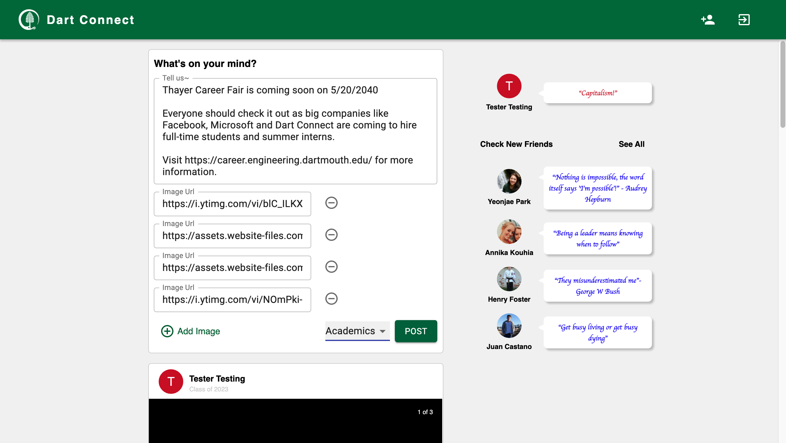
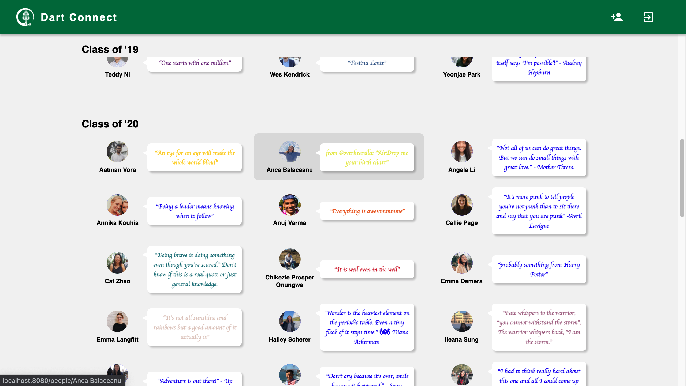

# DALI SNS Challenge

*Created a social network platform for the dali application. Modified instagram + facebook style platform that displays DALI members. Uses Google Firebase auth and database to support user and post creation.*

[Challenge url](https://github.com/dali-lab/dali-challenges/blob/master/docs/SocialMediaChallenge.md)

[Deployed url](https://nifty-jepsen-d9e082.netlify.app)

## Landing Page

Landing Page is the first page of the platform. It allows users to creat their accounts by filling out a simple form with a simple input validation. Google Auth is used to create an account.

## Log In Page

Simple log in page for a user with an account.

## Homepage

Homepage is the landing page for users that logged in to their account. In the center, it shows recent 20 posts stored in Firebase. 

On the right, it shows the user's info (name, avatar, quote in their fav color). It also shows DALI members to check out, which is randomly chosen from the members list.

Users can also create a post with or without images. Users can also choose a tag, which is optional as well. For posts with more than one image, the platform uses carousels to slide through images.

## Members Page

This page shows a list of DALI members. The list was retrieved from github page using axios. The list is sorted by class year and alphabetical order. Users can click a member to go to their profile page. 

## Profile Page

This page shows the general information of a DALI member. It also uses Mapquest API to show the home of a member. While some maps are inaccurate, most of them shows correct locations.

